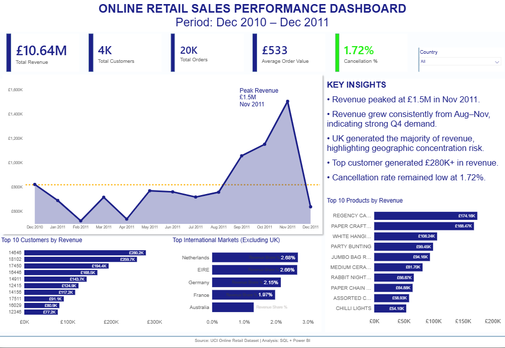
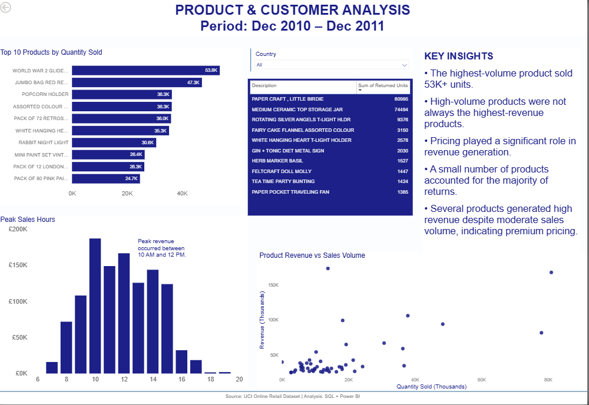

# Retail Sales Analysis

## Project Overview

This project analyzes an online retail dataset using SQL and Power BI to identify revenue trends, customer behavior, product performance, and return patterns.

## Tools Used

- Excel
- SQL
- Power BI

## Business Questions

1. What is the total revenue generated?
2. Which month generated the highest revenue?
3. What are the top products by revenue?
4. Which products sold the highest quantity?
5. Which countries contributed the most revenue?
6. Who are the top customers?
7. What percentage of revenue comes from the top customers?
8. What is the cancellation rate?
9. Which products are returned most frequently?
10. During which hours does the business generate the most revenue?

## Key Insights

- Revenue peaked at £1.5M in November 2011.
- The UK generated over 84% of total revenue.
- High-volume products were not always the highest-revenue products.
- A small number of products accounted for most returns.
- Peak sales occurred between 10 AM and 12 PM.

## Dashboard Preview

### Executive Overview

### Product & Customer Analysis

